# react-native-demo
学习Facebook官方Examples运行效果。

## React Native 配置运行官方例子

<https://github.com/facebook/react-native>
****

### 1、运行App的工作

###### 1、React Native项目源码下载
React Native项目官方地址:https://github.com/facebook/react-native 我们可以使用如下命令把代码clone到本地。 或者通过SourceTree 克隆也可以。

	$ git clone https://github.com/facebook/react-native.git
	
具体目录结构如下：

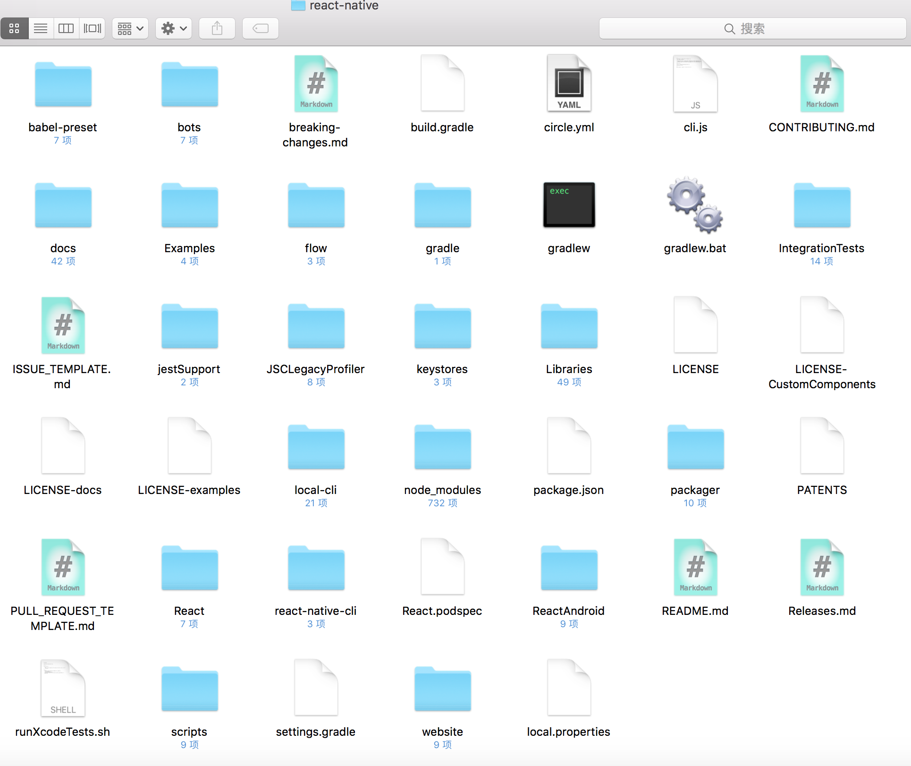

###### 2、Android环境要求如下，请确保你的环境已经达到如下要求:

①.Android Sdk版本23(在build.gradle中的compileSdkVersion)

②.SDK build tools version 23.0.1(build.gradle中buildToolsVersion)

③.Android Support Repository>=17

④·Andoid NDK需要安装好

[注]以上第①点到第③点的版本不需要和我这边一样，可以根据实际情况走，不过最好是最新版本哦~

###### 3、下面开始下载NDK以及配置

①.去官网下载NDK项目(注意科学上网):http://developer.android.com/ndk/downloads/index.html

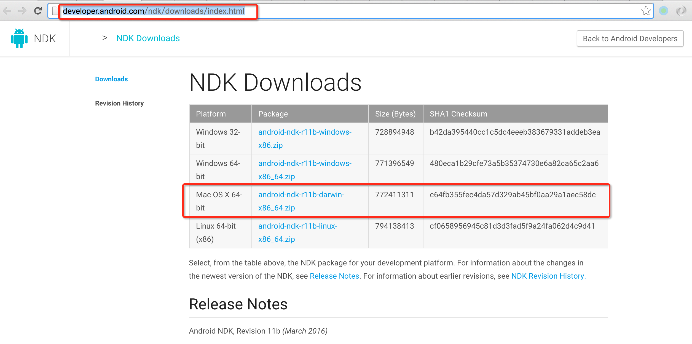

我的系统是OS X，所以下载了Mac 版本NDK了(NDK项目名: android-ndk-r11b-darwin-x86_64.zip)。
因为是.zip格式，所以就直接运行解压即可。然后在执行下面的动作，但是在这里说明下，这个是目前最新的ndk包，采用4.9－gcc编译，而facebook－react-native是4.8－gcc编译，所以会报以下错误

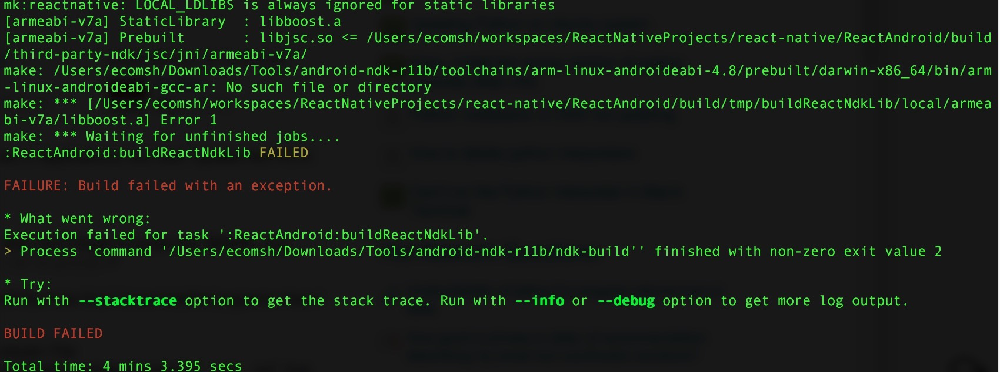

为了这个所以又重新下载了之前一点点ndk包：android-ndk-r10e-darwin-x86_64.bin

然后切换到该NDK文件所在目录运行如下命令进行改变权限以及解压缩即可了。

	$ chmod a+x android-ndk-r10e-darwin-x86_64.bin

接着运行解压缩命令, 进行解压缩NDK
	
	$ ./android-ndk-r10e-darwin-x86_64.bin

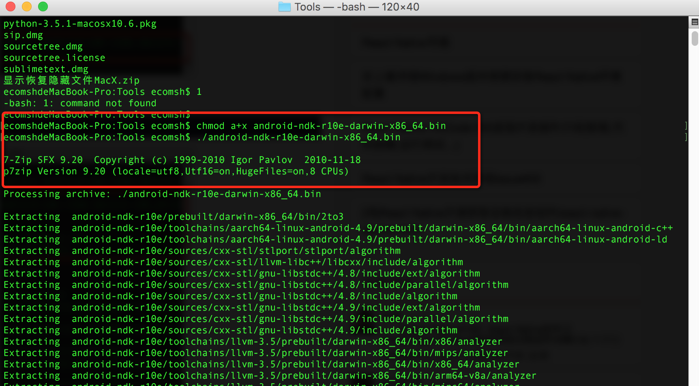

接下来配置.bash_proifle环境变量
	
	// Add Homebrew binary path to the front of the $PATH
	$ echo 'export PATH=/usr/local/bin:$PATH' >> ~/.bash_profile
	$ source ~/.bash_profile

或者 使用vi编辑，自己添加进去

	$ sudo vi ~/.bash_profile 
	
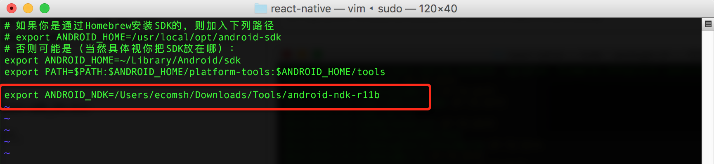

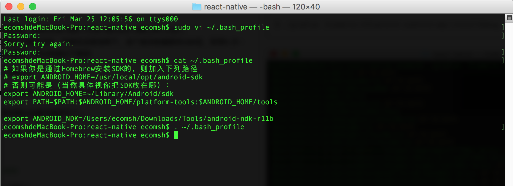

注意： 添加配置环境变量时，一定要执行下面命令，使配置文件生效。

	$ . ~/.bash_profile

###### 4、配置local.properties文件

react-native项目中添加local.properties文件，其中配置一下Android SDK和Android NDK的路径即可。
我们在clone出来的react-native项目的根目录创建local.properties文件，文件中添加信息如下:

	$ sudo vi local.properties

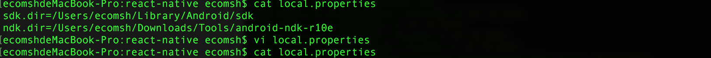

或

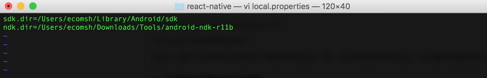

[注]以上里面的路径信息根据我本机的路径走得，实际情况还要看各位的SDK和NDK的路径。

###### 5、添加Node依赖模块:该命令行需要切到react-native项目中,主要运行如下命令

	$ cd react-native
	$ npm install
	
这样就添加了Node_Modules模块(其中包含了react-native核心库)

###### 6、运行相应Demo(这边主要演示UIExplorer项目，其他项目运行方法相似)

	$ ./gradlew :Examples:UIExplorer:android:app:installDebug
	
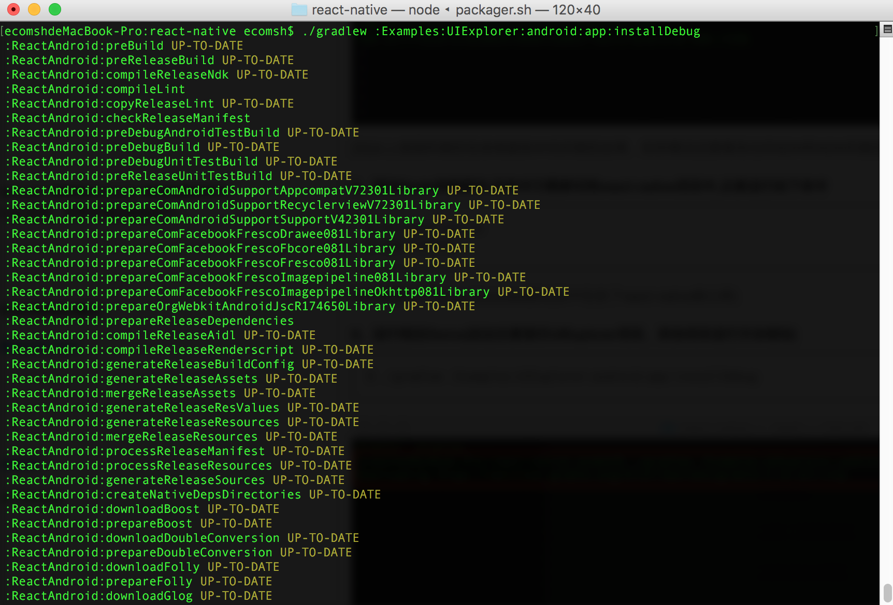
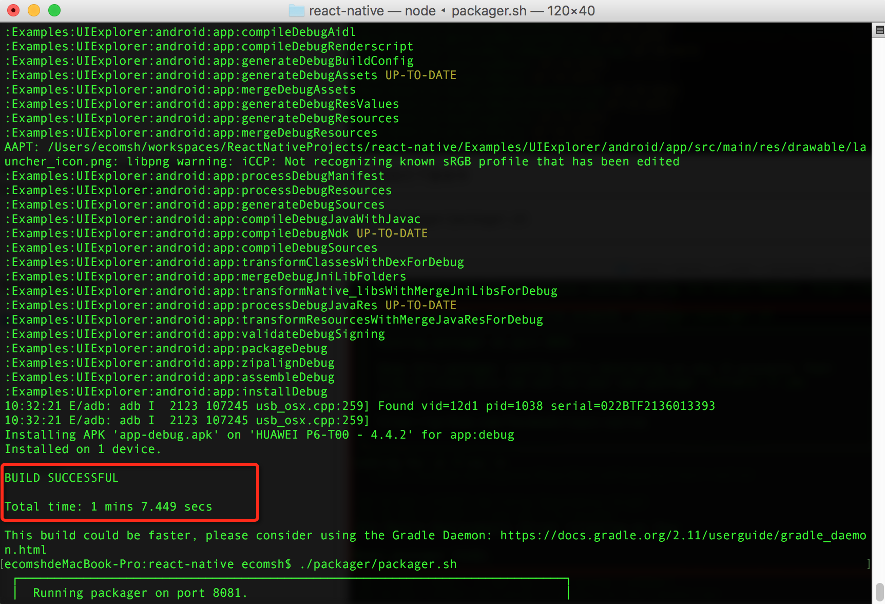

###### 7、接着运行如下命令带起服务器,然后点击打开模拟器中的APP

	$ ./packager/packager.sh
	
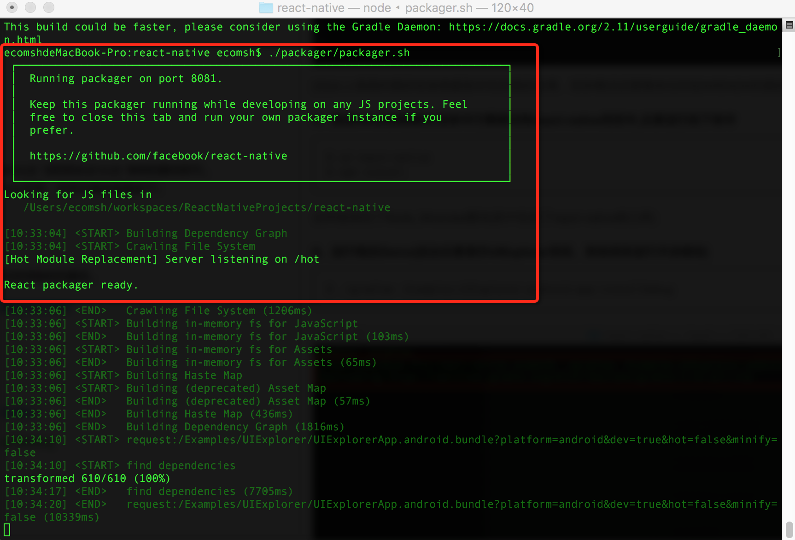

###### 8、运行UIExplorer界面效果图

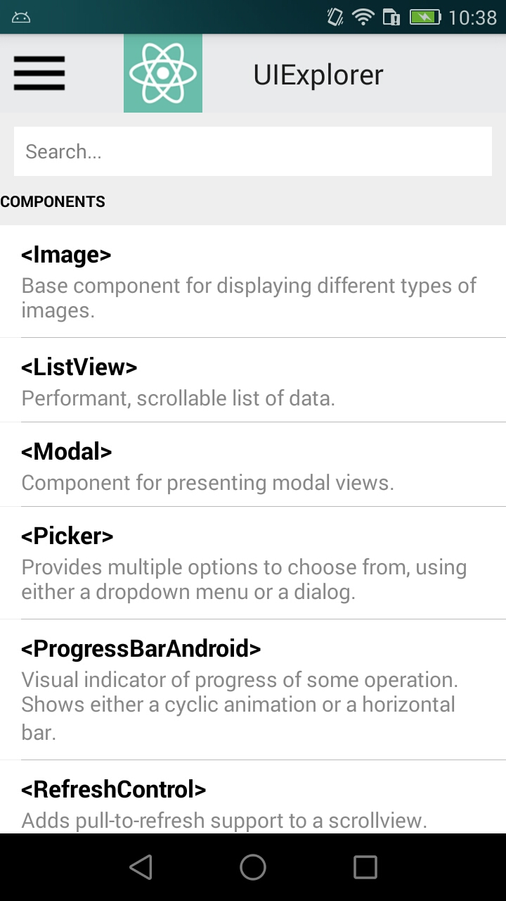

###### 9、在看看Movies效果

	$ ./gradlew :Examples:Movies:android:app:installDebug
	

###### 10、总结

本次跑通官方例子出现2个错误问题：

- 1、是在配置ndk环境变量的时候，配置完.bash_profile文件，没有执行 . ~/.bash_profile 命令，所以刚配置的环境变量没有生效，最终导致运行：$ ./gradlew :Examples:UIExplorer:android:app:installDebug 命令失败。

其实android-ndk-r11b-darwin-x86_64.zip 和 android-ndk-r10e-darwin-x86_64.bin 都可以用的，只是我在配置环境变量时没执行配置文件，才导致失败的。

- 2、命令行代码写错了。例如：Examples 却写成了 "Example"